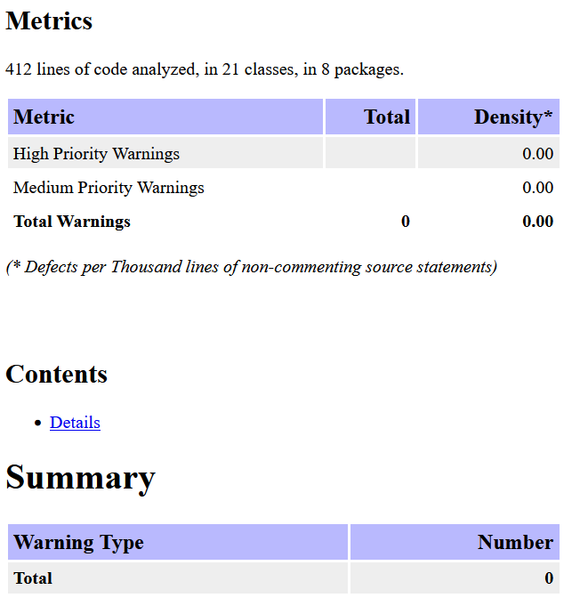

# Secure Spring Boot API

Простой, но защищенный веб-API на Java с использованием Spring Boot, Spring Security и Hibernate.

## Эндпоинты API

### 1. `POST /auth/login` - Аутентификация
**Запрос:**
```json
{
  "username": "user",
  "password": "pass"
}
```

### 2. `GET /api/data` - Получение статуса

### 3. `PUT /api/data` - Обновление статуса
**Запрос:**
```json
{
  "status": "status"
}
```

## Меры защиты

### 1. Защита от SQL-инъекций (SQL Injection)
**Реализация:** Hibernate ORM
- Все SQL-запросы генерируются автоматически через JPA Repository
- Пользовательские данные передаются как типизированные параметры

### 2. Защита от XSS
**Реализация:** Spring Security + валидация данных
- Spring автоматически экранирует HTML/JS в ответах
- Входные данные валидируются через Bean Validation
- Content-Type заголовки устанавливаются корректно для JSON

### 3. Защита аутентификации (JWT + BCrypt)
**Хэширование паролей:**
- Пароли хэшируются алгоритмом BCrypt перед сохранением

**JWT аутентификация:**
- Время жизни токена ограничено
- Фильтр проверяет валидность токена для каждого запроса

**Security конфигурация:**
- Эндпоинты `/auth/**` публичные, остальные требуют аутентификации

## Отчет SAST



## Статус сборки

[](https://github.com/ivandemidov04/infseclab1/actions/workflows/ci.yml)